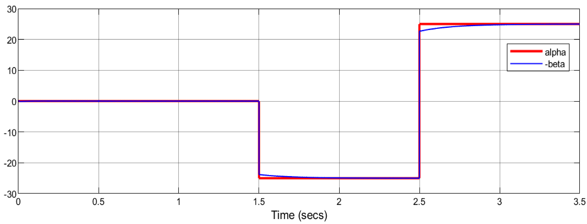
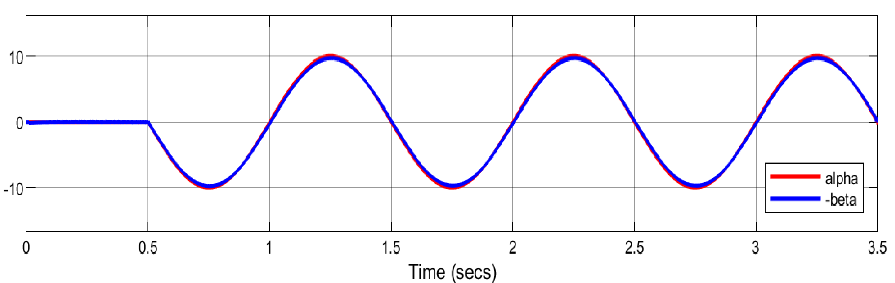

# False Data Injection Cyber-Attack Mitigation in DC Microgrids using Artificial Neural Networks

## Overview

This repository contains MATLAB codes and SIMULINK models and on the simulation and mitigation of False Data Injection Attacks (FDIAs) in DC microgrids, based on artificial neural networks. It is a critical part of ensuring cybersecurity in power systems that rely on communication networks for control. This work is based on case studies discussed in the IEEE reference paper titled "False Data Injection Cyber-Attacks Mitigation in Parallel DC/DC Converters based on Artificial Neural Networks" (DOI: 10.1109/TCSII.2020.3011324) and two cases of the paper have been simulated.

### Reference paper and its abstract:

M. R. Habibi, H. R. Baghaee, T. Dragičević and F. Blaabjerg, "False Data Injection Cyber-Attacks Mitigation in Parallel DC/DC Converters Based on Artificial Neural Networks," in IEEE Transactions on Circuits and Systems II: Express Briefs, vol. 68, no. 2, pp. 717-721, Feb. 2021, doi: 10.1109/TCSII.2020.3011324.

Abstract: Because of the existence of communication networks and control applications, DC microgrids can be attacked by cyber-attackers. False data injection attack (FDIA) is one type of cyber-attacks where attackers try to inject false data to the target DC microgrid to destruct the control system. This brief discusses the effect of FDIAs in DC microgrids that are structured by parallel DC/DC converters and they are controlled by droop based control strategies to maintain the desired DC voltage level. Also, an effective and proper strategy based on an artificial neural network-based reference tracking application is introduced to remove the FDIAs in the DC microgrid.
keywords: {Microgrids;Biological neural networks;Neurons;Voltage control;Training;Circuits and systems;Artificial neural networks;cyber-attack;DC microgrid;droop control;false data injection attack},

URL: https://ieeexplore.ieee.org/stamp/stamp.jsp?tp=&arnumber=9146309&isnumber=9340029

https://doi.org/10.1109/TCSII.2020.3011324

### The provided code implements:
1. **FDIA Detection and Mitigation**: Utilizing artificial neural networks (ANN) to identify and correct malicious data injected into the system.
2. **Cybersecurity in DC Microgrids**: Simulating different FDIA scenarios in DC microgrids with parallel DC/DC converters.
3. **MATLAB Simulation Files**: `.m` files that showcase the ANN's training, testing, and performance evaluation in mitigating FDIAs.

### Features
- Artificial neural network for FDIA detection and correction.
- Case studies for constant and time-varying cyber-attacks.
- Analysis of neural network performance through MATLAB scripts and error plots.
- A Robust and scalable solution for microgrid control under attack scenarios.

### Prerequisites

- MATLAB
- Neural Network Toolbox
- Simulink

### Usage

1. Modify the data preparation script (`tain_data_prepare.m`) to suit your own system configuration if necessary.
2. Execute `test_trained_network.m` to visualize the performance of the neural network in real-time. This script outputs the prediction errors and computes the Mean Squared Error (MSE).

### Results

The simulation successfully mitigates false data injection attacks with an artificial neural network as demonstrated in two scenarios:
- **Case 1**: Constant FDIA at specific intervals.
- **Case 2**: Time-varying FDIA with sinusoidal patterns. The ANN efficiently detects and corrects the data.

- Case 1 Result:

(alpha: false data, -beta: estimated false data)

- Case 2 Result:

(alpha: false data, -beta: estimated false data)

### Tags:

- False Data Injection Attack (FDIA)
- Cybersecurity in Power Systems
- DC Microgrid Simulation
- Neural Network in Power Systems
- MATLAB Power Systems
- Artificial Intelligence in Energy
- Smart Grid Security
- DC/DC Converters
- Parallel DC Converters
- Droop Control Method
- MATLAB Neural Networks
- Cyber-Physical Systems
- Energy Security
- Power System Stability
- Attack Mitigation in Microgrids
- Power System Control
- ANN-based Power Systems
- Power Systems Cyber Attacks
- Power Systems Simulation
- Electric Power System Engineering

I hope it would be helpful !
Hamed Najafi
